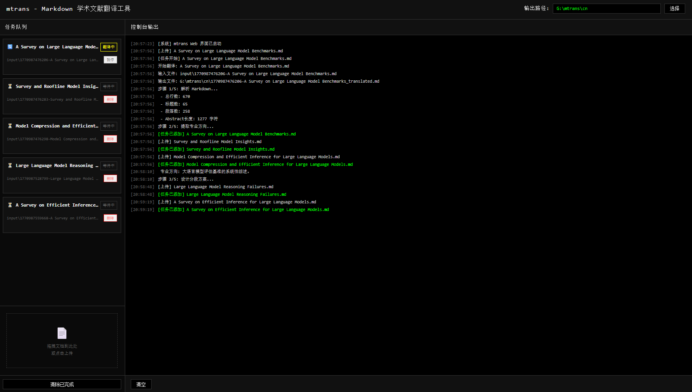

# mtrans - Markdown 学术文献翻译工具
一款基于智谱GLM-4.7打造的英文学术文献Markdown翻译工具，精准适配学术场景需求，支持智能分段、并发翻译与实时进度可视化，让长文文献翻译高效又省心。
github链接： https://github.com/applex250/mtrans

### 推荐使用流程
先通过[MinerU Client](https://mineru.net/client)完成PDF转Markdown格式转换，再使用本工具进行专业翻译，一站式打通文献处理全流程。

### 开发初衷与设计思想
日常使用豆包翻译时，发现其翻译效果精准贴合学术需求，但面对超长篇幅的Markdown文献（如99页内容），易出现翻译中断的问题。为解决这一痛点，依托GLM大模型搭建专属学术翻译工作流，设计思路简洁且贴合实际使用场景：
->1. **智能切分长文**：提取Markdown文档的一、二级标题，统计各标题对应段落字数并提交至大模型，由模型自主分析并制定最优分段方案，适配大模型单次对话的输入长度限制，避免因内容过长导致的翻译卡顿。
->2. **锚定文章主旨**：将文献摘要（Abstract）作为系统提示词嵌入翻译全过程，让每一段落的翻译都贴合全文核心主题，保证翻译的连贯性与语境一致性。
->3. **无缝合并译文**：分段翻译完成后，自动按原文结构合并内容，还原文献完整排版与逻辑层次。

### 核心特性
- ✅ **智能分段**：大模型自主分析文档结构，定制贴合模型输入规则的分段方案，适配长文献翻译
- ✅ **并发翻译**：支持多段落并行翻译，最大化提升翻译效率，实现速度优先
- ✅ **实时进度**：可视化进度条动态展示翻译进程，同步显示翻译速度，进度一目了然
- ✅ **术语一致**：智能提取专业领域术语，全程保持术语翻译统一，贴合学术写作规范
- ✅ **元素保留**：翻译过程中完整保留表格、公式、代码块、图片等特殊元素，不破坏原文格式
- 🌐 **友好Web界面**：极简黑白极客风格设计，支持拖拽上传文档，搭配任务队列管理，操作便捷高效

